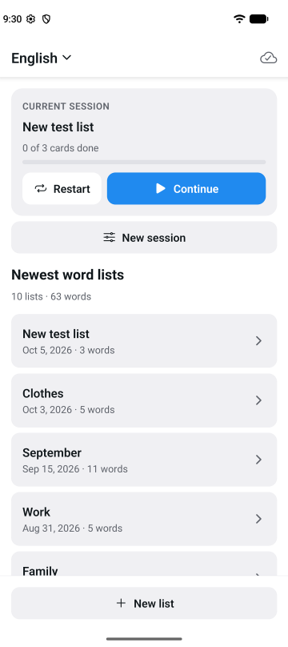
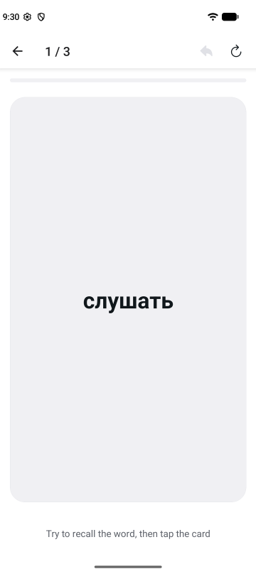
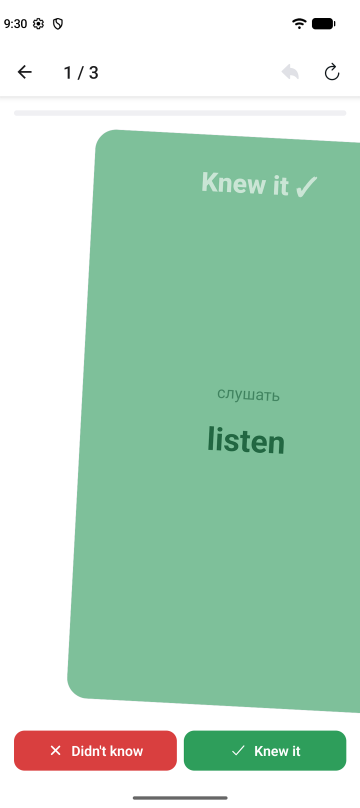
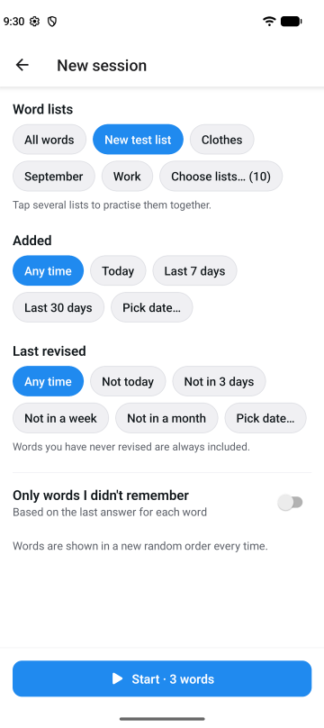
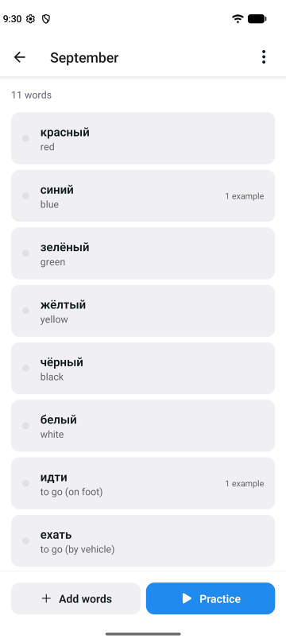

# SwipeWise

**Learn foreign words with flashcards: flip a card, then swipe right if you knew it, left if you didn't.**

SwipeWise is an Android app for growing your vocabulary in the language you're learning. You add your
own words, for example the new words from every lesson, and practise them with quick flashcard sessions.
Your words can live in a Google Spreadsheet that you can also edit on your computer.

---

<table>
  <tr>
    <td align="center"> Home</td>
    <td align="center"> Recall the word…</td>
    <td align="center"> …flip and swipe</td>
    <td align="center"> Choose what to practise</td>
    <td align="center"> Your word lists</td>
  </tr>
</table>

## How it works

| Front                 | Back                               |
|-----------------------|------------------------------------|
| машина                | **car**                            |
|                       | *Don't drive your car too fast.*   |

1. A card shows a word in **your native language**.
2. Try to remember the word in the language you're learning, then **tap the card** to flip it.
3. The back shows the word and, if you added them, **example sentences**.
4. **Swipe right** if you knew it, **swipe left** if you didn't (or use the buttons).

SwipeWise remembers when you last practised each word and whether you knew it, so you can focus on the
words you keep forgetting.

## Features

- **Courses** – learning English and Spanish? Each language is its own course with its own words.
  Switch courses from the top of the home screen.
- **Word lists** – group words into lists, e.g. one list per lesson. A new list is named after today's
  date unless you give it a name. Lists can be renamed, deleted and **merged** (All lists → Select).
- **Pronunciation** – tap 🔊 to hear the word in the language you're learning (your phone's voices, works
  offline); optionally read aloud whenever a card is flipped.
- **Quick adding** – type the native word, the foreign word and optional examples; the form stays open
  for the next word.
- **Flexible sessions** – practise all words or a few selected lists, and narrow them down:
  - words **added since** a date (e.g. this week's lessons),
  - words **not revised since** a date,
  - only words you **didn't remember** last time.
- **Every session in a new order** – words are shuffled each time you start or restart.
- **Pick up where you left off** – the app opens with your last session and the card you stopped at.
  **Restart** goes through the same words again; **Recent** brings back any of your last 5 sessions.
- **Results** – after a session you see what you knew and can repeat just the words you missed.
- **Works offline** – everything is stored on your phone; no account is needed.
- **Google Sheets** – connect a course to a spreadsheet in your Google Drive. Add or fix
  words on your computer and the app picks them up; your progress is saved back to the sheet. The app can
  only see the spreadsheets it created, nothing else in your Drive. After reinstalling (or on a new phone),
  **Restore from Google Drive** brings your courses back.

## Status

The app works fully offline, syncs each course with its own Google Spreadsheet and restores courses from Google
Drive after a reinstall. Ideas: irregular verb forms for English, human recordings for pronunciation.

## More

- [TECHNICAL.md](TECHNICAL.md) – detailed behaviour, spreadsheet format, tech stack and development setup
- [implementationplan.md](implementationplan.md) – implementation plan and progress
- [PUBLISHING.md](PUBLISHING.md) – publishing on Google Play
